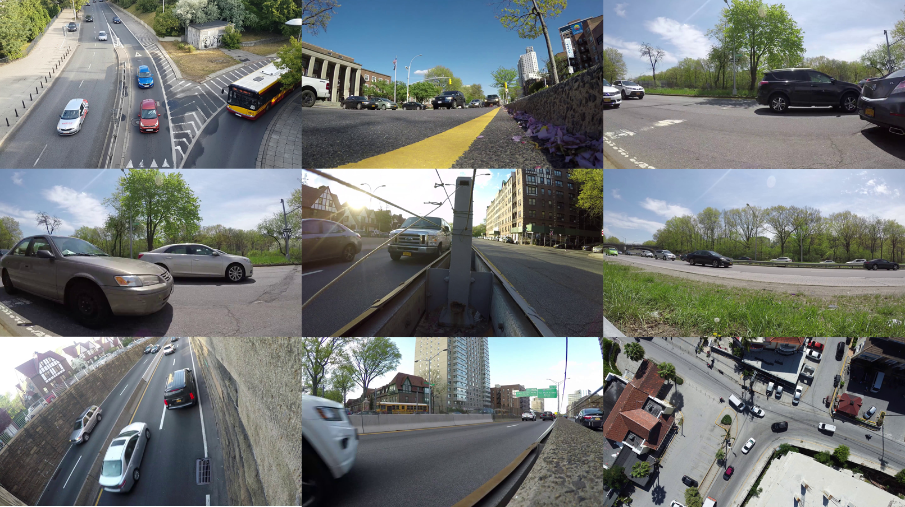
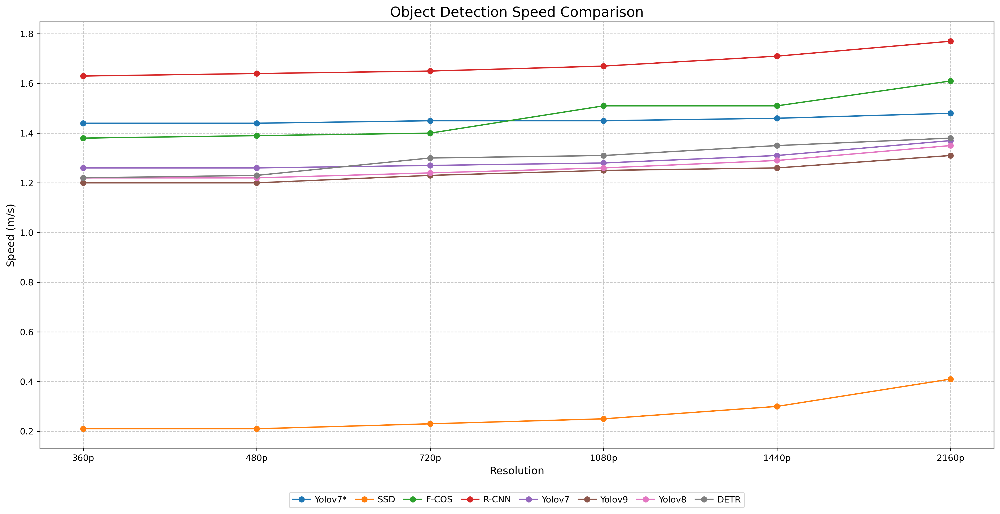
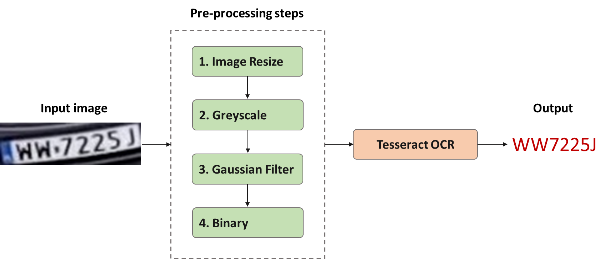
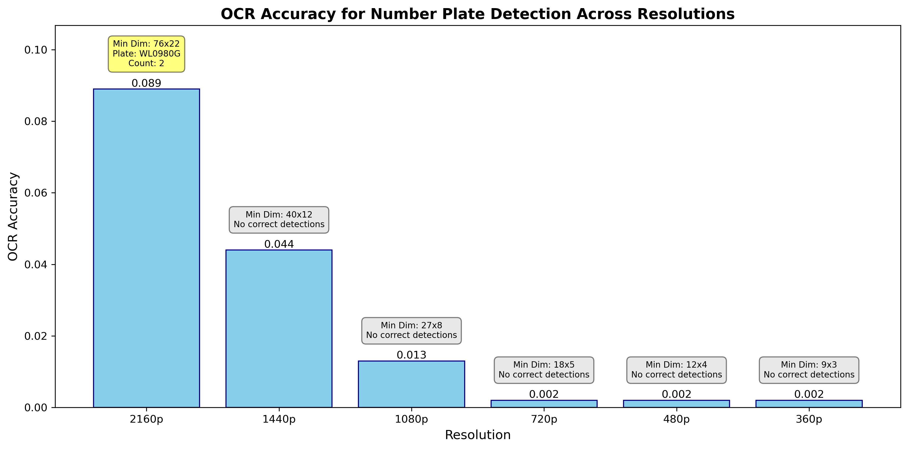

# Multi Resolution Traffic Monitoring Dataset (MRTMD)

<p align="right" style="text-align: right;"> <strong>"a traffic monitoring dataset containing multiple instances organised across a variety of transport scenes, captured at different resolutions."</strong> </p> <br> <p align="left" style="text-align: left;"> <strong>"a multi-resolution dataset designed to facilitate the evaluation of object detection models and Number Plate Recognition (NPR) in traffic monitoring applications."</strong> </p>

<p align='center'>
  
</p>

## Abstract
<p align="justify">
<i>
Traffic monitoring is an essential component of modern urban management. It reduces congestion, improves safety, and enhances environmental sustainability when implemented well. This is managed through real-time monitoring of traffic flows, anomaly detection and efficient traffic management. Convolutional Neural Networks (CNNs) have become integral to this domain due to their compact size and ease of deployment. However, these systems' effectiveness heavily depends on the quality of input data, particularly image resolution. The increasing availability of high-resolution cameras, especially 4K, raises questions about the optimal balance between image quality, detection accuracy, and system efficiency.
To address this challenge, we propose a novel dataset, the Multi-Resolution Traffic Monitoring Dataset (MRTMD), encompassing a range of transport scenes captured in multiple resolutions from 2160p (4K) to 360p. This dataset is designed to serve as a benchmark for comparing the performance of standard object detection models, enabling the development of more efficient and cost-effective solutions to traffic monitoring. The MRTMD will be freely available on GitHub, providing a valuable resource for researchers and practitioners.
We evaluate the performance of state-of-the-art object detection models, including YOLOv9, YOLOv8, YOLOv7, RCNN, FCOS, SSD, and DETR across different resolutions. Our analysis focuses on mean Average Precision (mAP), recall, and processing time. Additionally, we assess Number Plate Recognition (NPR) accuracy to evaluate performance in tasks requiring fine-grained detail extraction.
Our findings reveal that across different resolutions, object detection performance typically varies within a narrow range of ±0.01 to ±0.03 in terms of mAP and recall. This suggests that higher resolutions may not always provide significant advantages in detection tasks, challenging the assumption that the highest resolution is necessary. However, higher resolutions proved crucial for maintaining accuracy for specific tasks like NPR. The multi-resolution dataset allows for a comprehensive evaluation of this trade-off between image quality and task performance.
Furthermore, our analysis highlights the substantial impact of resolution choice on storage and bandwidth requirements in large-scale deployments, providing valuable insights for system designers and policymakers. This dataset thus serves as a vital tool for optimising the balance between performance, cost, and practical constraints in real-world traffic monitoring systems.
</i>
</p>

## Experimentation

### Object Detection

In our experimentation, we conducted a comprehensive evaluation of several state-of-the-art object detection models using the Multi-Resolution Traffic Monitoring Dataset (MRTMD). The models tested included YOLOv9, YOLOv8, YOLOv7, RCNN, FCOS, SSD, and DETR. These models were chosen for their diverse architectural designs and widespread use in the field of computer vision, particularly in traffic monitoring scenarios.

<p align='center'>
  
</p>

The primary focus of our experiments was to assess the models' performance across a range of image resolutions, from 2160p (4K) to 360p. We measured performance using standard metrics such as mean Average Precision (mAP) and recall, as well as processing time to evaluate the trade-offs between detection accuracy and computational efficiency.

Our results showed that YOLOv7 consistently delivered the highest mAP values across most resolutions, indicating its robustness and adaptability to varying input qualities. This model performed particularly well at mid-range resolutions, making it a strong candidate for applications where a balance between detection accuracy and computational cost is crucial. YOLOv9, on the other hand, demonstrated stable performance across resolutions, with its best results at higher resolutions, making it more dependent on higher-quality inputs for optimal detection accuracy. Despite this, YOLOv9 emerged as the fastest model in terms of processing time, making it ideal for real-time applications where speed is critical.

YOLOv8 also performed well at higher resolutions but showed a notable decline in mAP at lower resolutions, indicating sensitivity to input quality. FCOS exhibited similar behavior, performing better at higher resolutions and requiring further tuning for lower resolution inputs. RCNN, while capable of achieving high mAP at certain resolutions, generally showed a drop in performance as resolution decreased, suggesting its suitability for mid to high-resolution inputs.

<p align='center'>
  
</p>

The DETR model displayed considerable variability across resolutions, with fluctuating mAP values that highlighted its potential need for fine-tuning depending on the specific resolution. SSD, in contrast, consistently underperformed across all tested resolutions, demonstrating limited effectiveness in this object detection task.


### Number Plate Recognition (NPR)

In our study, we implemented a comprehensive process for Optical Character Recognition (OCR) of number plates, using the Tesseract OCR engine. This process involved multiple pre-processing steps designed to enhance image quality and improve the accuracy of text recognition, particularly in challenging traffic monitoring environments.

<p align='center'>
  
</p>

The initial step involved resizing the images by 200%, which increased the pixel count and potentially enhanced the clarity of text elements. Following this, the resized images were converted to greyscale to remove any unnecessary color information, simplifying the image content for the OCR process. A Gaussian filter was then applied to the greyscale images to reduce noise while preserving essential edges, crucial for accurately identifying the text regions. After noise reduction, adaptive thresholding was employed to convert the images into binary form, which highlighted the text against the background, making it easier for the OCR engine to differentiate between characters and other elements in the image.

Despite these meticulous pre-processing steps, our results indicated a significant dependency of OCR accuracy on image resolution. At the highest resolution of 2160p, the OCR system achieved an accuracy of 0.089, which, while low, was still significantly better than at lower resolutions. As the resolution decreased, the accuracy dropped precipitously, with 1440p yielding an accuracy of 0.044 and 1080p dropping further to 0.013. Resolutions below 720p produced extremely low accuracy rates, down to 0.002, indicating severe challenges in recognising number plates at these levels.

<p align='center'>
  
</p>

The analysis further revealed that the smallest image dimensions where OCR could achieve an accuracy greater than 0.800 were 76x22 pixels at 2160p resolution. At lower resolutions, while some correct detections were noted, these were too sporadic and unreliable to be considered effective for practical use. The most accurately identified plate at 2160p, "WL0980G," was detected correctly only twice, and no correct detections were recorded at resolutions below this, underscoring the critical importance of high resolution for effective number plate recognition.

## Conclusion
The Multi-Resolution Traffic Monitoring Dataset (MRTMD) distinguishes itself through several key strengths, making it a valuable resource for researchers and developers:

- **Comprehensive Coverage:** With 4,062 images captured from varying camera angles, the dataset provides a detailed representation of real-world traffic conditions, supporting robust model evaluation.

- **Resolution Variability:** The inclusion of identical images at different resolutions allows for the assessment of model performance across various resolution settings. This feature is particularly useful for optimising models based on specific IP camera configurations.

- **Model Efficiency Testing:** The dataset enables researchers to determine the optimal model for specific resolution constraints, ensuring effective performance in real-world applications.

- **Stability Under Degraded Conditions:** The diversity in resolution makes the MRTMD an excellent tool for measuring model stability when camera feed quality degrades, a common issue in bandwidth-limited environments such as remote traffic monitoring or mobile settings.

- **Versatility:** The variety in camera angles and resolutions makes the dataset suitable not only for object detection tasks but also for evaluating Optical Character Recognition (OCR) performance, especially in Number Plate Recognition (NPR) scenarios.

- **Application Relevance:** These strengths collectively make the MRTMD dataset a critical resource for advancing research and development in fields that demand robust, adaptable, and efficient visual recognition systems for traffic monitoring.

## Accessing Dataset
To access this dataset, kindly use the following code:

```python
# Packages Install
!pip install gitpython
import git
import shutil
import os

# Cloning repository
repo_url = 'https://github.com/markbugeja/Multi-Resolution-Traffic-Monitoring-Dataset-MRTMD-.git'
repo_dir = 'MRTMD'  # Directory to clone the repository into

# Checking if the repository directory already exists
if not os.path.exists(repo_dir):
    # Cloning repository
    git.Repo.clone_from(repo_url, repo_dir)
    print("Repository cloned successfully.")
else:
    print("Repository already cloned.")

```

<!-- ## Citation
To cite this paper, kindly use the following citation:

```bib

```

## How to Use the Dataset

### Dataset Structure

The `images` folder contains five subfolders, each with images of different resolutions:
- `2160p`
- `1440p`
- `1080p`
- `720p`
- `480p`
- `360p`

### Ground Truth Annotations

For each resolution, corresponding ground truth annotations can be found in the `ground_truth` folder. The annotation files are named according to their respective resolution sets, such as `groundtruth_2160p.json`.

### COCO Categories

The ground truth annotations are based on COCO format and include the following categories:
- **Person**: 
  - `id`: 1
  - `supercategory`: person
- **Bicycle**: 
  - `id`: 2
  - `supercategory`: vehicle
- **Car**: 
  - `id`: 3
  - `supercategory`: vehicle
- **Motorcycle**: 
  - `id`: 4
  - `supercategory`: vehicle
- **Bus**: 
  - `id`: 6
  - `supercategory`: vehicle
- **Truck**: 
  - `id`: 8
  - `supercategory`: vehicle

### Model Validation

When validating a model using this dataset, you can utilise `pycocotools`, a Python API for loading, parsing, and visualising annotations in COCO format. This tool facilitates the evaluation of model performance against the provided ground truth annotations.


